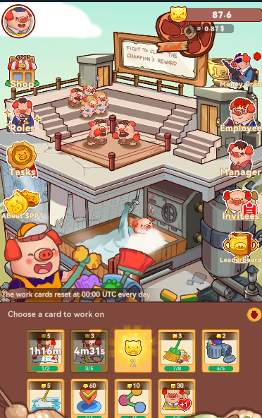

---

# piggy-bot

Piggy-bot [piggy piggy bot](https://t.me/PiggyPiggyofficialbot/game?startapp=share_5221388128).

<p align="center">
  
</p>

### Tính năng

- Tự động chạy công việc mỗi giờ
- Tự động nhận thưởng
- Tự động nhận thanh toán cửa hàng sao
- Tự động hoàn thành phần thưởng chia sẻ
- Hỗ trợ nhiều tài khoản

### Cách sử dụng

- Thêm config.json vào thư mục configs

```json
[
  {
    "token": "query_id=AAFKwhUiAAAA.."
  }
]
```

- Cài đặt các module

```bash
npm install
```

- Chạy script

```bash
npm run start
```

[ CẢNH BÁO ] bot này đang trong giai đoạn phát triển, nếu bot gặp lỗi, bạn có thể thử lại. Một số lỗi hoặc sự cố sẽ được khắc phục.

### Truy vấn Token

Bạn có thể tìm thấy trên công cụ inspect element [F12] từ telegram web. Mở bot và xem [ `on application - session storage -__telegram__initParams - tgWebAppData ` ]

- `query_id=AAFKwhUiAAAA`

- Ví dụ truy vấn

```json
"query_id=AAF"
```
